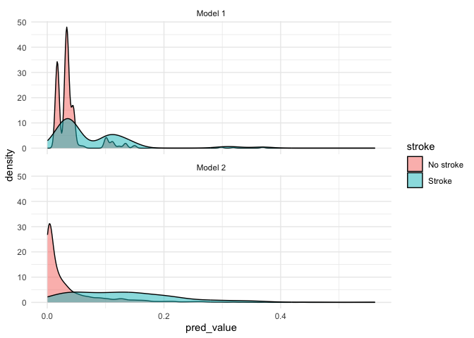
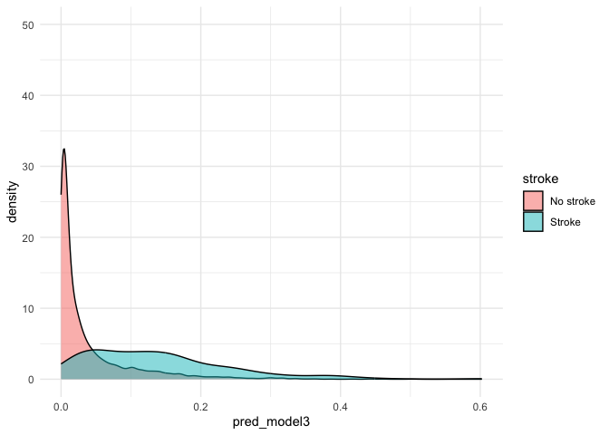
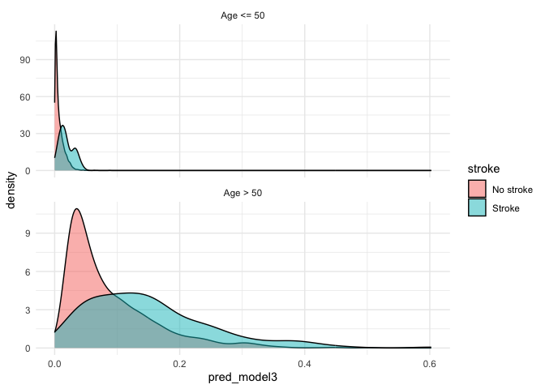
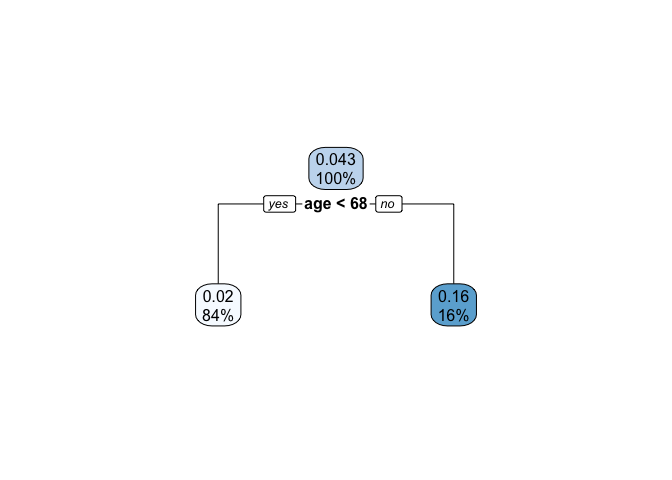
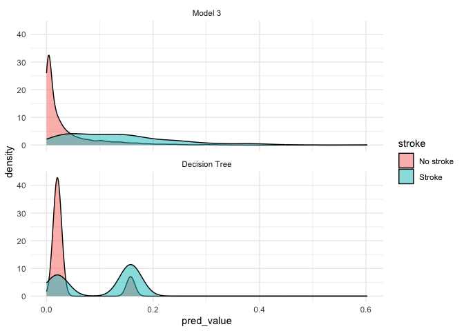

PUBH 7463 Assignment 2
================
Kristin Elgersma

``` r
# Read in data
stroke <- read_csv(here("data", "stroke.csv"))

stroke <- stroke %>%
  mutate(
    across(
      -c(age, avg_glucose_level, bmi),
      as.factor
    )
  )
```

### Question 1

``` r
# Model 1
model1 <- glm(stroke ~ heart_disease + hypertension + smoking_status,
  data = stroke,
  family = "binomial"
)

# Model 2
model2 <- glm(
  stroke ~ heart_disease + hypertension + smoking_status + age +
    avg_glucose_level + bmi,
  data = stroke,
  family = "binomial"
)


# Obtain predicted probabilities from both models
stroke$pred_model1 <- predict(model1, newdata = stroke, type = "response")
stroke$pred_model2 <- predict(model2, newdata = stroke, type = "response")

# Rename stroke levels
levels(stroke$stroke) <- c("No stroke", "Stroke")
```

``` r
# Pivot longer to facet plots by model
stroke_long <- stroke %>%
  pivot_longer(
    cols = c(pred_model1, pred_model2), names_to = "model", values_to = "pred_value"
  ) %>%
  mutate(model = fct_recode(
    model,
    "Model 1" = "pred_model1",
    "Model 2" = "pred_model2"
  ))

# Plot the density plot
stroke_long %>%
  ggplot() +
  geom_density(aes(x = pred_value, fill = stroke), alpha = 0.5) +
  facet_wrap(~model, nrow = 2) +
  theme_minimal()
```

<!-- -->

``` r
# Table
table1 <- stroke_long %>%
  select(id, model, stroke, pred_value) %>%
  group_by(model, stroke) %>%
  summarize(
    mean_pred = mean(pred_value, na.rm = TRUE),
    med_pred = median(pred_value, na.rm = TRUE),
    sd_pred = sd(pred_value, na.rm = TRUE)
  ) %>%
  ungroup()

knitr::kable(
  table1,
  col.names = c("Model", "Stroke Observed?", "Mean prediction", "Median prediction", "SD prediction")
)
```

| Model   | Stroke Observed? | Mean prediction | Median prediction | SD prediction |
|:--------|:-----------------|----------------:|------------------:|--------------:|
| Model 1 | No stroke        |       0.0409763 |         0.0326098 |     0.0391241 |
| Model 1 | Stroke           |       0.0785242 |         0.0444208 |     0.0726425 |
| Model 2 | No stroke        |       0.0385413 |         0.0137576 |     0.0585836 |
| Model 2 | Stroke           |       0.1332809 |         0.1254725 |     0.0950056 |

Based on the plots and tables, it appears that Model 2 more accurately
predicts stroke risk. In the plot, there is greater differentiation
between the mean predicted probability in the Stroke (0.13) vs. No
stroke (0.04) group in Model 2. In the Model 1 density graph, there are
very few observed strokes at higher predicted probabilities, and in
Model 2, the “No stroke” counts are more accurately plotted near 0
probability.

### Question 2

``` r
model3 <- glm(stroke ~ gender + age + hypertension + heart_disease + ever_married +
  work_type + Residence_type + avg_glucose_level + bmi + smoking_status, data = stroke, family = "binomial")

# Obtain predicted probabilities
stroke$pred_model3 <- predict(model3, newdata = stroke, type = "response")
```

``` r
# Plot
stroke %>%
  ggplot() +
  geom_density(aes(x = pred_model3, fill = stroke), alpha = 0.5) +
  theme_minimal() +
  ylim(0, 50)
```

<!-- -->

``` r
# Table
table2 <- stroke %>%
  select(id, stroke, pred_model3) %>%
  group_by(stroke) %>%
  summarize(
    mean_pred = mean(pred_model3, na.rm = TRUE),
    med_pred = median(pred_model3, na.rm = TRUE),
    sd_pred = sd(pred_model3, na.rm = TRUE)
  ) %>%
  ungroup()

knitr::kable(
  table2,
  col.names = c("Stroke Observed?", "Mean prediction", "Median prediction", "SD prediction")
)
```

| Stroke Observed? | Mean prediction | Median prediction | SD prediction |
|:-----------------|----------------:|------------------:|--------------:|
| No stroke        |       0.0383467 |         0.0129303 |     0.0590130 |
| Stroke           |       0.1376579 |         0.1209023 |     0.1034864 |

While Model 3 appears quite similar to Model 2, it appears to be a
little bit better at predicting stroke (e.g., slightly greater
differentiation between the mean predicted probability in “stroke” and
“no stroke” groups).

### Question 3

``` r
# Create dichotomous age variable
stroke <- stroke %>%
  mutate(
    age_50 = if_else(age < 51, "Age <= 50", "Age > 50"),
    age_50 = factor(age_50)
  )

# Plot the density plot
stroke %>%
  ggplot() +
  geom_density(aes(x = pred_model3, fill = stroke), alpha = 0.5) +
  facet_wrap(~age_50, nrow = 2, scales = "free_y") +
  theme_minimal()
```

<!-- -->

``` r
# Table
table3 <- stroke %>%
  select(id, age_50, stroke, pred_model3) %>%
  group_by(age_50, stroke) %>%
  summarize(
    mean_pred = mean(pred_model3, na.rm = TRUE),
    med_pred = median(pred_model3, na.rm = TRUE),
    sd_pred = sd(pred_model3, na.rm = TRUE)
  ) %>%
  ungroup()

knitr::kable(
  table3,
  col.names = c("Age", "Stroke Observed?", "Mean prediction", "Median prediction", "SD prediction")
)
```

| Age        | Stroke Observed? | Mean prediction | Median prediction | SD prediction |
|:-----------|:-----------------|----------------:|------------------:|--------------:|
| Age \<= 50 | No stroke        |       0.0074680 |         0.0047535 |     0.0076925 |
| Age \<= 50 | Stroke           |       0.0185263 |         0.0162496 |     0.0111279 |
| Age \> 50  | No stroke        |       0.0871659 |         0.0623829 |     0.0707456 |
| Age \> 50  | Stroke           |       0.1509651 |         0.1361316 |     0.1006331 |

It appears that Model 3 is better at predicting stroke for older
individuals. For those \<=50 who did have a stroke, the mean predicted
probability is only 0.019, which is low and not well differentiated from
individuals who did have a stroke (0.007). The highest mean predicted
probability is for those age \> 50, at 0.15.

### Question 4

``` r
# Create 5 age cut points
stroke <- stroke %>%
  mutate(stroke_num = if_else(stroke == "Stroke", 1, 0)) %>% # Revert stroke variable back to numeric for probabilities
  mutate(
    age_10 = if_else(age < 11, "<=10", ">10"),
    age_20 = if_else(age < 21, "<=20", ">20"),
    age_30 = if_else(age < 31, "<=30", ">30"),
    age_40 = if_else(age < 41, "<=40", ">40"),
    age_50 = if_else(age < 51, "<=50", ">50")
  ) %>%
  mutate(across(starts_with("age_"), as.factor))

# Compare stroke probability between multiple age cut points
table4 <- stroke %>%
  select(age_10, age_20, age_30, age_40, age_50, stroke_num) %>%
  pivot_longer(
    cols = c(age_10, age_20, age_30, age_40, age_50),
    names_to = "name",
    values_to = "age_group"
  ) %>%
  select(-name) %>%
  group_by(age_group) %>%
  summarize(
    n = n(),
    prob = mean(stroke_num),
  )

knitr::kable(
  table4,
  col.names = c("Age Group", "N in group", "Prob of stroke")
)
```

| Age Group | N in group | Prob of stroke |
|:----------|-----------:|---------------:|
| \<=10     |        493 |      0.0000000 |
| \>10      |       4416 |      0.0473279 |
| \<=20     |       1000 |      0.0010000 |
| \>20      |       3909 |      0.0532105 |
| \<=30     |       1536 |      0.0006510 |
| \>30      |       3373 |      0.0616662 |
| \<=40     |       2184 |      0.0027473 |
| \>40      |       2725 |      0.0744954 |
| \<=50     |       2900 |      0.0072414 |
| \>50      |       2009 |      0.0935789 |

The cut point with the largest difference in stroke probability between
partitions is \<=50 vs. \>50.

### Question 5

``` r
library(rpart)
library(rpart.plot)

# Create and plot decision tree
stroke_tree <- rpart(stroke_num ~ gender + age + hypertension + heart_disease + ever_married + work_type + Residence_type + avg_glucose_level + bmi + smoking_status, data = stroke)

rpart.plot(stroke_tree)
```

<!-- -->

1.  The root node is age.
2.  The leaf nodes are age \<68 and age \>=68.
3.  The age \<68 leaf node contains 84% of observations (n=4124). The
    age \>=68 leaf node contains 16% of the observations (n=785).
4.  The predicted probability of strok in \<68 = 0.02, and the predicted
    probability \>= 68 =0.16.

``` r
# Generate predicted probabilities
pred_stroke <- predict(stroke_tree)
```

`pred_stroke` only contains two unique values because each individual is
in one of the two age groups (\<68 or \>=68), and therefore has the
predicted probability for that age group.

``` r
# Add prediction to stroke data frame
stroke$pred_tree <- predict(stroke_tree)

# Pivot longer to facet plots by model
stroke_long_tree <- stroke %>%
  pivot_longer(
    cols = c(pred_model3, pred_tree), names_to = "model", values_to = "pred_value"
  ) %>%
  mutate(model = fct_recode(
    model,
    "Model 3" = "pred_model3",
    "Decision Tree" = "pred_tree"
  ))

# Plot
stroke_long_tree %>%
  ggplot() +
  geom_density(aes(x = pred_value, fill = stroke), alpha = 0.5) +
  facet_wrap(~model, nrow = 2) +
  theme_minimal()
```

<!-- -->

``` r
# Table
table5 <- stroke_long_tree %>%
  select(id, model, stroke, pred_value) %>%
  group_by(model, stroke) %>%
  summarize(
    mean_pred = mean(pred_value, na.rm = TRUE),
    med_pred = median(pred_value, na.rm = TRUE),
    sd_pred = sd(pred_value, na.rm = TRUE)
  ) %>%
  ungroup()

knitr::kable(
  table5,
  col.names = c("Model", "Stroke Observed?", "Mean prediction", "Median prediction", "SD prediction")
)
```

| Model         | Stroke Observed? | Mean prediction | Median prediction | SD prediction |
|:--------------|:-----------------|----------------:|------------------:|--------------:|
| Model 3       | No stroke        |       0.0383467 |         0.0129303 |     0.0590130 |
| Model 3       | Stroke           |       0.1376579 |         0.1209023 |     0.1034864 |
| Decision Tree | No stroke        |       0.0399007 |         0.0203983 |     0.0480026 |
| Decision Tree | Stroke           |       0.1027126 |         0.1580278 |     0.0676397 |

The decision tree doesn’t seem to provide an improvement in accuracy for
predicting stroke over the logistic regression model. There is less
differentiation between the mean predicted probability of stroke in the
“stroke” and “no stroke” groups in the decision tree (although this
doesn’t hold true when looking at the median predicted probability).
Additionally, the density of the distribution in the decision tree plot
is similar between groups, as both the “no stroke” and “stroke” groups
spike at around 0.15, which suggests insufficient differentiation
between groups.
